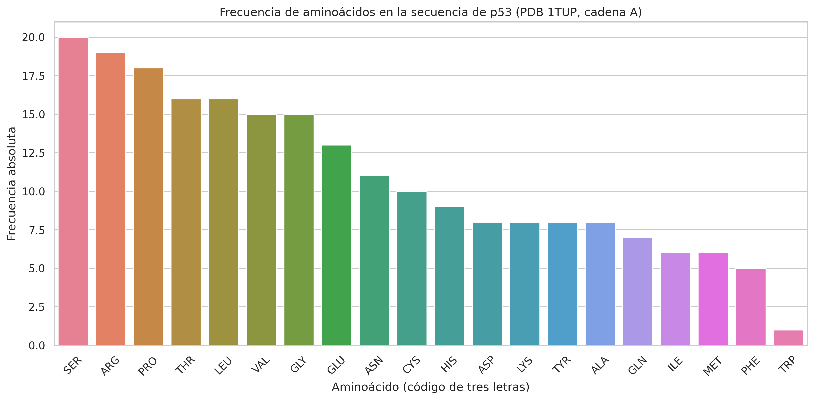
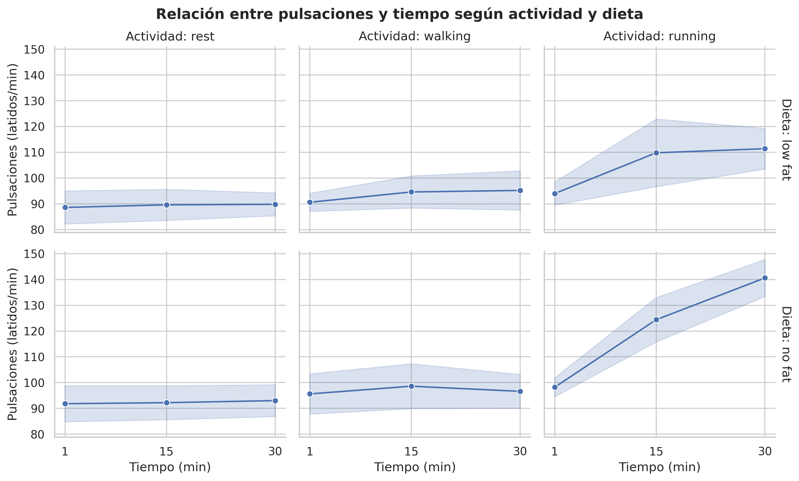

# Conceptos fundamentales de Python

El objetivo de esta actividad es afianzar los conocimientos esenciales de Python que permitirán implementar con éxito las herramientas bioinformáticas propuestas en los sucesivos temas.

La solución completa está en [actividad1_resuelta_ruben_juarez.py](actividad1_resuelta_ruben_juarez.py) y ha sido compilada y ejecutada sin errores. El script incluye los comandos de **Conda/Spyder**, comentarios explicativos, control de errores, rutas relativas mediante `pathlib`, comprobación automática de la longitud `SEQRES`, validación de las cadenas A/B/C, validación del `merge` y generación reproducible de todos los resultados.

## Estructura del proyecto

- [actividad1_resuelta_ruben_juarez.py](actividad1_resuelta_ruben_juarez.py) — script principal con la solución completa.
- `1tup.pdb`, [actividad.csv](actividad.csv), [ciudades.tsv](ciudades.tsv) — ficheros de entrada (deben estar en la misma carpeta que el script).
- `resultados/` — carpeta generada al ejecutar el script, con las figuras y CSV de salida.
- [LEEME_SOLUCION.txt](LEEME_SOLUCION.txt) y [ejecucion_validacion.txt](ejecucion_validacion.txt) — resumen y log de validación de la ejecución real.

## 1. Fichero PDB 1TUP: metadatos y secuencia de p53

Del fichero `1tup.pdb` se extraen los campos `TITLE` y `AUTHOR`:

- **TITLE**: `TUMOR SUPPRESSOR P53 COMPLEXED WITH DNA`
- **AUTHOR**: `Y.CHO,S.GORINA,P.D.JEFFREY,N.P.PAVLETICH`

El PDB contiene tres copias de p53 (cadenas A, B y C). Se ha comprobado programáticamente que las tres secuencias son idénticas, por lo que el análisis se realiza sobre una única cadena (A), evitando triplicar artificialmente las frecuencias de aminoácidos. La secuencia resultante contiene exactamente **219 aminoácidos**, coincidiendo con el número declarado en el registro `SEQRES`.

### Frecuencia de aminoácidos (cadena A)

El diccionario de conteo se construye dinámicamente mediante `.get()`, sin definir manualmente sus claves, tal como exige el enunciado.

| Aminoácido | Frecuencia | Aminoácido | Frecuencia |
|---|---|---|---|
| SER | 20 | ASP | 8 |
| ARG | 19 | LYS | 8 |
| PRO | 18 | TYR | 8 |
| LEU | 16 | GLN | 7 |
| THR | 16 | ILE | 6 |
| GLY | 15 | MET | 6 |
| VAL | 15 | PHE | 5 |
| GLU | 13 | TRP | 1 |
| ASN | 11 | | |
| CYS | 10 | | |
| HIS | 9 | | |
| ALA | 8 | | |

**Total: 219**, que coincide de nuevo con la longitud declarada en `SEQRES`.

## 2. Datos de actividad física con Pandas

El conjunto de datos [actividad.csv](actividad.csv) contiene **90 registros y 5 columnas**, sin ninguna celda vacía.

- **2 niveles de dieta**: `low fat` (45 registros) y `no fat` (45 registros).
- **3 grupos de actividad**: `rest`, `walking` y `running`, con 30 observaciones cada uno. Esto explica formalmente por qué `list(groupby(...))` contiene tres elementos, siendo cada uno una tupla `(nombre_del_grupo, DataFrame_del_grupo)`.

### Pulsaciones medias y desviación estándar por actividad (`agg()`)

| Actividad | Media pulsaciones | Desviación estándar |
|---|---|---|
| rest | 90.833 | 5.831 |
| walking | 95.200 | 6.779 |
| running | 113.067 | 17.620 |

### Fusión con datos de ciudades

El enunciado menciona dos ficheros CSV, pero el segundo fichero entregado es en realidad [ciudades.tsv](ciudades.tsv), separado por tabulaciones. El código lo trata correctamente mediante `sep="\t"`.

El `merge` se ha validado como relación `many_to_one`: conserva las **90 observaciones**, no deja ningún ID sin ciudad asignada, y añade las ciudades Mollina, Cartagena, Palma, Mérida, Valencia y Barcelona.

## 3. Visualización

Para el apartado gráfico no se ha optado por una gráfica básica, sino por la opción de mayor puntuación: una **única figura multifacetada 2×3**, con las dietas en filas y las actividades en columnas, el tiempo convertido correctamente a 1, 15 y 30 minutos, la media de pulsaciones y una banda de ±1 desviación estándar.

**Gráfico de frecuencia de aminoácidos de p53**

**Figura multifacetada pulsaciones–tiempo por dieta y actividad**

